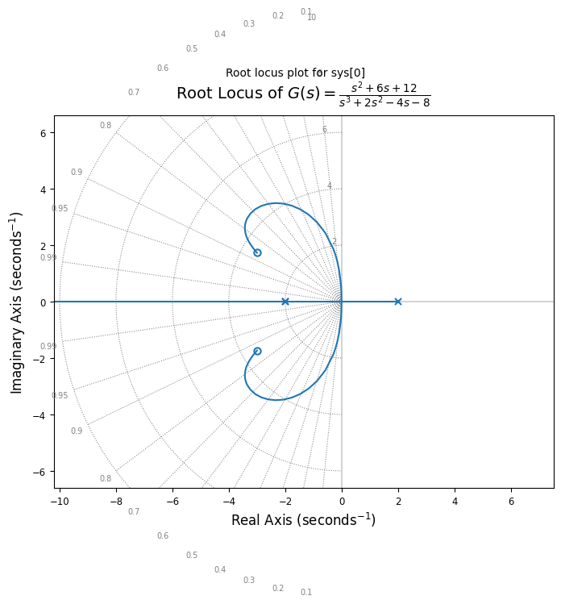
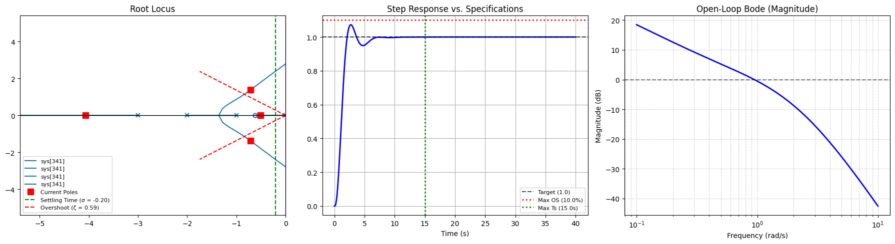

# Control Systems in Python

This repository contains Python tools for control systems engineering. It includes two interactive Jupyter Notebooks:

1. **Root Locus Analysis** ([rlocus.ipynb](rlocus.ipynb)) — A step-by-step mathematical breakdown of the root locus method.
2. **Interactive PID Controller Designer** ([control_system_designer.ipynb](control_system_designer.ipynb)) — A real-time dashboard for tuning PID controllers with visual feedback inspired by the [MATLAB Control System Toolbox](https://www.mathworks.com/help/control/index.html)

This project was developed for a Control Systems course, implementing the calculations as a step-by-step Jupyter Notebook.

---

## Getting Started & Installation

Before running the notebooks, you need to set up your virtual environment and install the required dependencies:

### Using `uv` (Recommended)
If you have [uv](https://github.com/astral-sh/uv) installed:
1. Sync the dependencies and create the `.venv` environment:
   ```bash
   uv sync
   ```
2. Run Jupyter Lab:
   ```bash
   uv run jupyter lab
   ```

### Using standard `pip`
Alternatively, you can use Python's built-in `venv` and `pip`:
1. Create a virtual environment:
   ```bash
   python3 -m venv .venv
   ```
2. Activate the virtual environment:
   - **Linux/macOS:**
     ```bash
     source .venv/bin/activate
     ```
   - **Windows:**
     ```cmd
     .venv\Scripts\activate
     ```
3. Install the dependencies and Jupyter:
   ```bash
   pip install -e .
   pip install jupyterlab
   ```
4. Launch Jupyter Lab:
   ```bash
   jupyter lab
   ```

---

## Root Locus Analysis

A detailed, step-by-step Jupyter Notebook implementing the [Root Locus](https://en.wikipedia.org/wiki/Root_locus_analysis) method, a graphical technique used to analyze system stability and performance as the feedback gain $K$ is varied.

### Features

- **Symbolic Formulation:** Utilizes `sympy` to display the open-loop transfer function $G(s)$ in both standard and factorized forms using symbolic variable $s$.
- **Geometric Analysis:** Extracts open-loop poles ($n$) and zeros ($m$) using the `control` library, and computes the asymptote centroid ($\sigma_c$) and angles.
- **Critical Points:** Identifies breakaway and break-in points by evaluating the roots of the derivative of the characteristic polynomials (`np.polyder`). Validates candidates by ensuring the calculated gain $\hat{k}$ is real and positive ($\ge 0$).
- **Stability Thresholds:** Analyzes imaginary axis crossings by substituting $s = j\omega$ into the characteristic equation. It separates the real and imaginary parts using `sympy` to solve for physical crossing frequencies ($\omega$) and their corresponding marginal stability gains ($K$).
- **Visualization:** Draws the root locus plot with damping ratio ($\xi$) and natural frequency ($\omega_n$) grids.

> [!note]
> The imaginary axis crossing points are not calculated using the Routh-Hurwitz stability criterion. For simplicity, they are computed by substituting $s = j\omega$ into the characteristic equation $P_k(j\omega) = 0$ (where $P_k(s) = D(s) + k N(s) = 0$) and solving for real values of $\omega$ and $K$.

### How to Use

1. Ensure your virtual environment is set up and activated (see [Getting Started & Installation](#getting-started--installation)).
2. Launch Jupyter Lab or open the project in VS Code with the Jupyter extension.
3. Select `.venv` as your notebook kernel.
3. Run the cells to see:
   - LaTeX-formatted transfer function decomposition (standard and factorized).
   - Numerical verification of valid/invalid breakaway and break-in points.
   - Step-by-step imaginary axis crossings and critical gains.
4. Modify the transfer function in the open-loop definition cell to analyze different systems. Enter the coefficients of the numerator and denominator polynomials as lists in the `num` and `den` variables. You must enter all coefficients (even for terms with 0 coefficients). E.g.:

   ```python
   num = [2, -4]  # 2s - 4
   den = [1, 2, 2]  # s^2 + 2s + 2
   ```

### Visualization

Below is a generated plot of the root locus for the transfer function $G(s) = \frac{s^2 + 6s + 12}{s^3 + 2s^2 - 4s - 8}$:



---

## Interactive PID Controller Designer 

An interactive dashboard for designing PID controllers for linear time-invariant (LTI) systems. By adjusting the $K_p$, $K_i$, and $K_d$ gains via sliders or direct input, you can instantly observe the effects on the system's root locus, step response, and Bode plot.

### Features

- **Real-time Tuning:** Dynamically constructs the controller $C(s)$ and closed-loop system $T(s)$ using `ct.feedback()`. Drag `ipywidgets` sliders or type exact values to adjust the proportional ($K_p$), integral ($K_i$), and derivative ($K_d$) gains.
- **Performance Evaluation:** Computes step response metrics using `ct.step_info()`. It displays the measured overshoot ($M_{\mathrm{p}}$), settling time ($T_{\mathrm{s}}$), and closed-loop poles, providing instant pass/fail indicators against user-defined maximum overshoot ($M_{\mathrm{max}}$) and maximum settling time ($T_{\mathrm{s,max}}$).
- **Synchronized Visualizations:** 
  - **Root Locus:** Plots the open-loop system (`ct.root_locus`) with the current closed-loop poles highlighted. Overlays geometric design boundaries corresponding to the required decay rate ($\sigma$) and damping ratio ($\xi$).
  - **Step Response:** Displays the time-domain step response (`ct.step_response`) with threshold overlays for maximum allowed overshoot and settling time.
  - **Bode Diagram:** Plots the open-loop Bode magnitude diagram (`ct.frequency_response`) to analyze frequency-domain behavior.
- **Flexible Setup:** Works with any plant transfer function $G(s)$ by simply providing its numerator $N(s)$ and denominator $D(s)$ coefficients as lists.

### How to Use

1. Ensure your virtual environment is set up and activated (see [Getting Started & Installation](#getting-started--installation)).
2. Open [control_system_designer.ipynb](control_system_designer.ipynb) in Jupyter or VS Code.
3. Select `.venv` as your notebook kernel.
3. Run all cells from the top.
4. Use the sliders or type values in the text boxes to adjust the PID gains.
5. To analyze a different plant, modify the `num` and `den` lists in the plant definition cell. E.g.:

   ```python
   num = [10]
   den = [1, 6, 11, 6]  # s^3 + 6s^2 + 11s + 6
   ```

### Visualization

Below is a screenshot of the interactive designer dashboard:



---

## Requirements
The project requires **Python >= 3.12**.

### Dependencies
All required packages are managed in `pyproject.toml`:

| Dependency | Purpose |
| :--- | :--- |
| `control` | Control systems library (transfer functions, root locus) |
| `numpy` | Numerical calculations, polynomials, and roots |
| `matplotlib` | High-quality plotting and visualization |
| `sympy` | Symbolic mathematics (derivative, equation solving) |
| `ipykernel` | Jupyter Notebook kernel support |
| `ipywidgets` | Interactive widgets (sliders, text inputs, layout) |

---

## References

1. **Textbooks:**
   - Benvenuti, L., De Santis, A., & Farina, L. *[Sistemi dinamici. Modellistica, analisi e controllo](https://search.worldcat.org/title/849463082)*. McGraw-Hill.
   - Bolzern, P., Scattolini, R., & Schiavoni, N. *[Fondamenti di controlli automatici](https://search.worldcat.org/title/918981992)*. McGraw-Hill Education.
2. **Online Resources:**
   - [Python Control Systems Library Documentation](https://python-control.readthedocs.io/)
   - [MATLAB Control System Toolbox Documentation](https://www.mathworks.com/help/control/index.html)
   - [Wikipedia: Root Locus](https://en.wikipedia.org/wiki/Root_locus)
   - [SymPy Documentation](https://docs.sympy.org/)

---

## Feedback & Contributions

> [!tip]
> If something doesn't work as expected, or if you have any suggestions, please feel free to **open an issue** or submit a **pull request**!