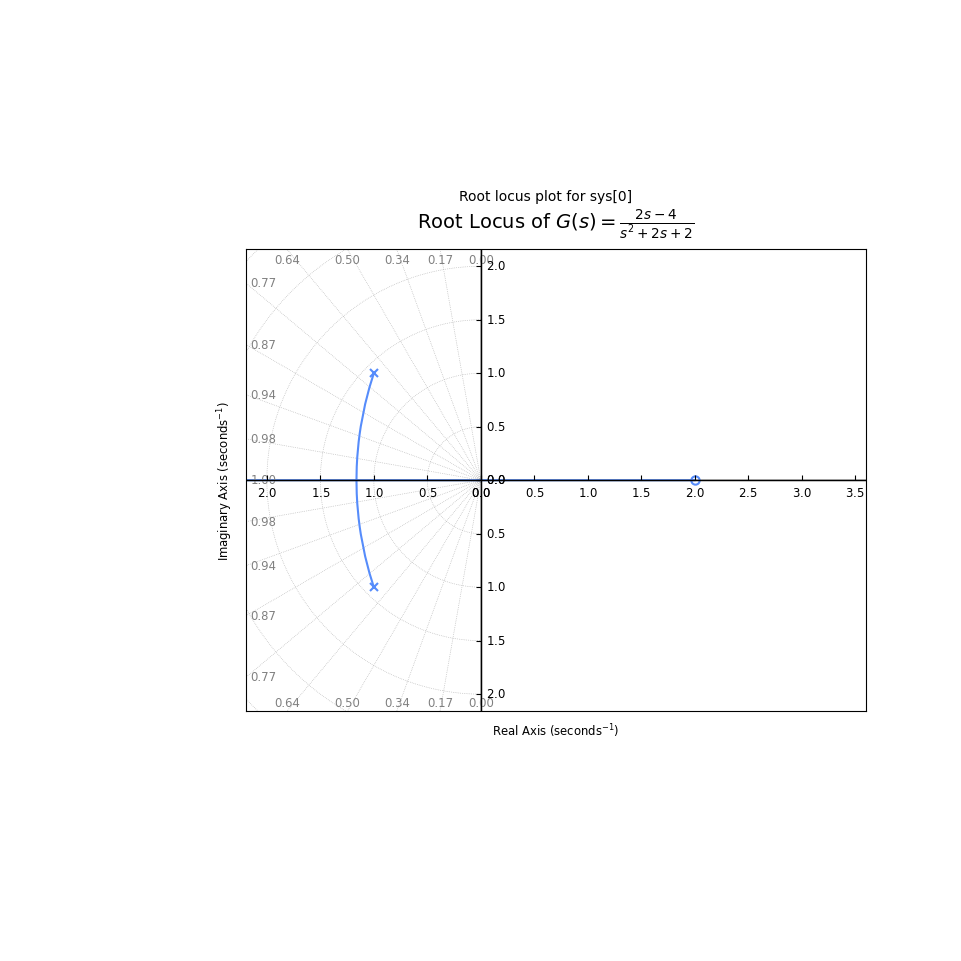

# Root Locus Plot in Python

This repository contains a Python implementation of the [Root locus](https://en.wikipedia.org/wiki/Root_locus_analysis) plot, a graphical method widely used in control systems engineering to analyze the stability and performance of a system as a parameter (usually the feedback gain $K$) is varied.

This project was developed for a Control Systems course, implementing the calculations as a step-by-step Jupyter Notebook.

## Features

- **Geometric Analysis:** Calculates poles, zeros, asymptote centroid ($\sigma_c$), and asymptote angles.
- **Critical Points:** Solves for breakaway and break-in candidates ($dK/ds = 0$).
- **Stability Thresholds:** Analyzes imaginary axis crossings ($\omega$ and corresponding gain $K$) using symbolic solving.
- **Visualization:** Draws the root locus plot with damping ratio ($\zeta$) and natural frequency ($\omega_n$) grids.

>[!note]
>The imaginary axis crossing points are not calculated using the Routh-Hurwitz stability criterion. For simplicity, they are computed by substituting $s = j\omega$ into the characteristic equation $P_k(j\omega) = 0$ (where $P_k(s) = D(s) + k N(s) = 0$) and solving for real values of $\omega$ and $k$.

---

## Visualizations

Below is a generated plot of the root locus for the transfer function $G(s) = \frac{2s - 4}{s^2 + 2s + 2}$:



---

## Requirements

The project requires **Python >= 3.12**.

### Dependencies
All required packages are managed in `pyproject.toml`:

| Dependency | Purpose |
| :--- | :--- |
| `control` | Control systems library (transfer functions, root locus) |
| `numpy` | Numerical calculations, polynomials, and roots |
| `matplotlib` | High-quality plotting and visualization |
| `sympy` | Symbolic mathematics (derivative, equations solving) |
| `ipykernel` | Jupyter Notebook kernel support |

---

## How to Use It


### Running the Jupyter Notebook

The notebook [rlocus.ipynb](rlocus.ipynb) provides a detailed, step-by-step mathematical breakdown using SymPy for algebraic derivations.

1. Launch Jupyter Lab or open the project in VS Code with the Jupyter extension.
2. Select `.venv` as your notebook kernel.
3. Run the cells to see:
   - LaTeX-formatted transfer function decomposition.
   - Numerical verification of valid/invalid breakaway points.
   - Step-by-step imaginary axis crossings.
4. Modify the transfer function in the first cell to analyze different systems. Enter the coefficients of the numerator and denominator of the open loop transfer function as lists num = [] and denum = []. You must enter all coefficients (even the terms with 0 coefficients). E.g.:

   ```python
   num = [2, -4]  # 2s - 4
   denum = [1, 2, 2]  # s^2 + 2s + 2
   ```

---

## References

1. **Textbooks:**
   - Benvenuti, L., De Santis, A., & Farina, L. *[Sistemi dinamici. Modellistica, analisi e controllo](https://search.worldcat.org/title/849463082)*. McGraw-Hill.
   - Bolzern, P., Scattolini, R., & Schiavoni, N. *[Fondamenti di controlli automatici](https://search.worldcat.org/title/918981992)*. McGraw-Hill Education.
2. **Online Resources:**
   - [Python Control Systems Library Documentation](https://python-control.readthedocs.io/)
   - [Wikipedia: Root Locus](https://en.wikipedia.org/wiki/Root_locus)
   - [SymPy Documentation](https://docs.sympy.org/)